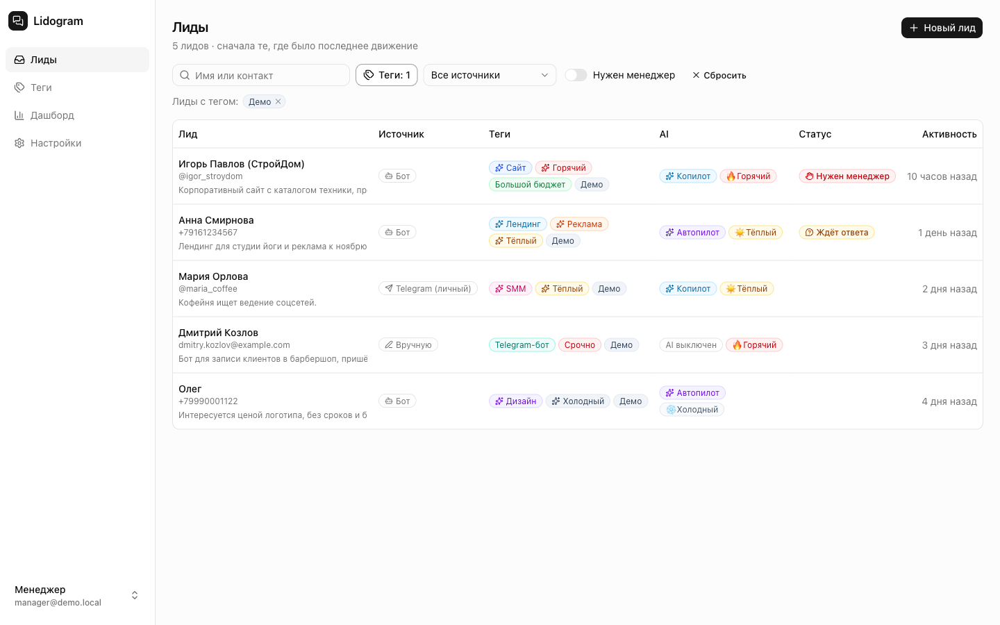
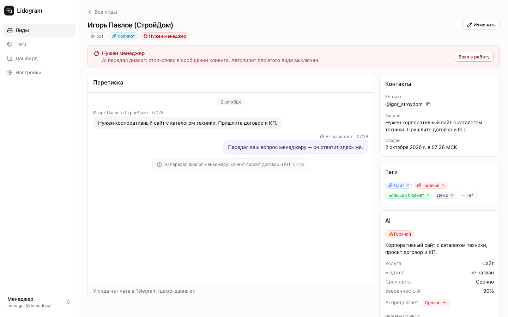
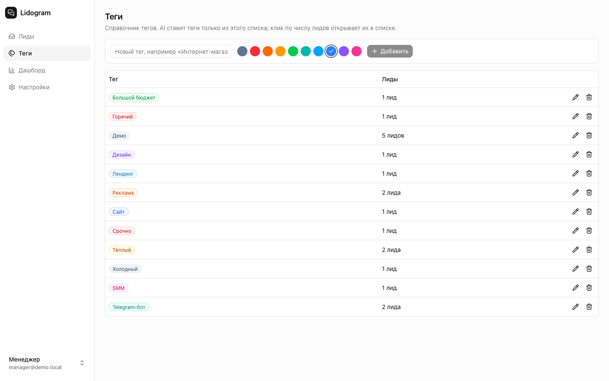
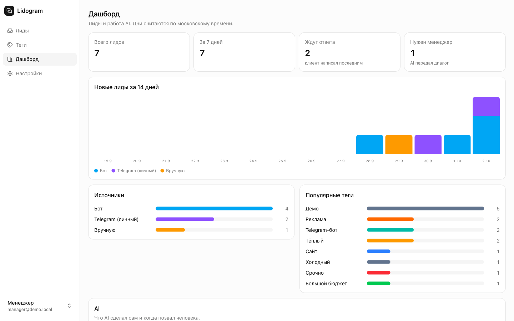
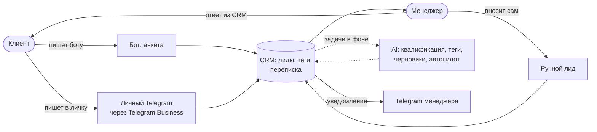

# Lidogram — мини-CRM для заявок агентства из Telegram

[](https://github.com/arsen10fe/telegram-leads-crm/actions/workflows/ci.yml)

Заявки сами собираются из Telegram в одну CRM и приходят уже разобранными: AI определяет услугу,
бюджет, срочность и «температуру» лида и ставит теги из справочника агентства. Менеджер фильтрует
лидов по тегам и отвечает прямо из карточки — ответ уходит клиенту в тот же чат. На типовые вопросы
может ответить AI-ассистент, а всё, что сложнее, он передаёт человеку.

Сделано за 3 дня как тестовое задание на позицию вайбкодера. Эскиз продукта —
[docs/product-sketch.md](docs/product-sketch.md), разбор — [docs/retrospective.md](docs/retrospective.md),
журнал работы с промптами — [docs/process-log.md](docs/process-log.md).

## Демо

| | |
|---|---|
| CRM | https://lidogram.72-56-101-176.sslip.io |
| Бот | [@testbotcrmebot](https://t.me/testbotcrmebot) |
| Вход | демо-логин и пароль уже подставлены на странице входа |

| Список лидов: фильтр по тегу, источник, AI | Карточка: переписка, передача менеджеру, AI-разбор |
|---|---|
|  |  |
| **Справочник тегов** | **Дашборд** |
|  |  |

## Задание

Из ТЗ, дословно:

> **Мини-CRM для заявок агентства.** Сделайте простую CRM, куда собираются лиды:
>
> 1. **Заявки из Telegram-бота.** Человек пишет боту, бот собирает заявку (имя, контакт, запрос) и
>    она сама появляется в CRM.
> 2. **Подключение обычного Telegram.** Входящие сообщения в подключённый Telegram тоже попадают в
>    CRM как лиды.
> 3. **Ручное добавление.** Лида можно завести в CRM руками.
> 4. **Теги.** Лидам можно присваивать теги и видеть лидов по тегу.
>
> В MVP обязательно должны работать пункты 1, 3 и 4 — от сообщения боту до лида с тегом в CRM.
> Пункт 2 — если успеваете; если нет, опишите в наброске продукта, как бы вы его сделали.

Сделаны все четыре пункта, включая необязательный второй:

| | Пункт | Как сделано | Где проверить |
|---|---|---|---|
| ✅ | 1. Бот | Анкета: имя → контакт (текстом или кнопкой «📱 Поделиться номером») → запрос. Лид появляется в CRM за секунды, затем AI ставит теги и пишет сводку. Повторные сообщения дописываются к тому же лиду, `/new` — новая заявка | [@testbotcrmebot](https://t.me/testbotcrmebot) → «Лиды» |
| ✅ | 2. Обычный Telegram | Telegram Business: бот подключается к личному аккаунту (нужен Premium) как чат-бот. Новые чаты становятся лидами с источником «Telegram (личный)», ответ из CRM уходит от имени этого аккаунта | «Настройки → Telegram Business» |
| ✅ | 3. Вручную | Кнопка «Новый лид»: имя, контакт, запрос, теги | «Лиды» → «Новый лид» |
| ✅ | 4. Теги | Справочник с цветами. Теги ставит менеджер или AI (только из справочника). Список фильтруется по тегам, на странице «Теги» — число лидов по каждому со ссылкой на список | Карточка лида, фильтр «Теги», страница «Теги» |

## Сверх задания

- **AI-разбор лида:** услуга, бюджет, срочность, «температура», сводка и теги — в фоне, после
  каждого нового сообщения.
- **Копилот:** кнопка «✨ Предложить ответ» — черновик по базе знаний агентства; менеджер правит и
  отправляет.
- **Автопилот** для лидов из бота: отвечает сам ценами «от» из базы знаний и передаёт диалог
  менеджеру по стоп-словам (договор, оплата, «позовите человека»…), при низкой уверенности или
  любой ошибке AI.
- **Уведомления менеджеру в Telegram:** новый лид (с тегами и сводкой) и передача диалога.
- **Переписка в карточке** и ответ из CRM в тот же чат — бот или личный аккаунт.
- **Дашборд:** лиды по дням, источникам и тегам; что AI сделал сам и когда позвал человека.
- **Живые обновления без перезагрузки:** раз в 4 с страница спрашивает сервер, изменилось ли
  что-то (~350 байт), и перерисовывается только тогда.
- **Надёжность обязательного пути:** сообщение сохраняется первым, AI — фоновые задачи в той же
  транзакции (outbox); повторная доставка от Telegram не создаёт дублей; бот переживает недоступность
  базы, не теряя сообщений.
- **327 тестов** (юнит и интеграционные с настоящим Postgres) и CI на GitHub Actions.

## Стек

| Слой | Технологии |
|---|---|
| Язык | TypeScript 5.9 (ESM) |
| CRM | Next.js 16 (App Router, Server Components, Server Actions), React 19 |
| Интерфейс | shadcn/ui, Tailwind CSS v4, lucide-react |
| Бот | grammY: long polling, Telegram Bot API и Telegram Business |
| Данные | PostgreSQL 17, Prisma ORM 7 (миграции), очередь фоновых задач в Postgres |
| AI | OpenAI Responses API, ответы строго по zod-схемам |
| Вход | bcryptjs + подписанная cookie-сессия (jose) |
| Логи | pino, структурированные, уровень через `LOG_LEVEL` |
| Тесты | Vitest |
| Инфраструктура | Docker Compose, nginx хоста + Let's Encrypt, GitHub Actions |

## Как проверить за 2 минуты

1. **Бот → лид (п. 1 ТЗ).** Напишите боту что угодно, ответьте на три вопроса: имя, контакт,
   запрос. Через несколько секунд лид появится в CRM, ещё через несколько — с AI-тегами и сводкой.
   Новые сообщения с того же аккаунта добавляются к этому лиду; вторую, отдельную заявку
   оставляет команда `/new`.
2. **Теги (п. 4).** В карточке лида добавьте или снимите тег; в списке лидов отфильтруйте по тегу.
   На странице «Теги» — справочник и число лидов по каждому тегу.
3. **Ручной лид (п. 3).** Кнопка «Новый лид» в списке.
4. **Личный Telegram (п. 2).** Напишите в личный Telegram-аккаунт, подключённый через Telegram
   Business, — появится лид с источником «Telegram (личный)».
5. **AI.** Спросите бота «сколько стоит лендинг?» — ответит автопилот, ценой «от» из базы знаний.
   Напишите «пришлите договор» — автопилот передаст диалог менеджеру, в CRM появится «Нужен
   менеджер», менеджеру придёт уведомление в Telegram. В карточке — «✨ Предложить ответ» (копилот).

## Как это устроено



- **Два процесса, одна кодовая база:** `web` (Next.js 16: CRM и Server Actions) и `bot` (grammY,
  long polling + очередь задач в Postgres). Оба используют одни и те же модули.
- **Обязательный путь не зависит от AI.** Сообщение сохраняется первым, лид создаётся в одной
  транзакции с задачами для AI (transactional outbox). Если OpenAI недоступен или выключен
  (`AI_ENABLED=false`), лиды и теги работают так же.
- **Модель предлагает, решает код.** OpenAI возвращает данные строго по zod-схеме; передать ли
  диалог человеку, какие теги поставить и что отправить — решают чистые функции. Любая ошибка AI —
  передача менеджеру, а не молчание.
- **Идемпотентность через уникальный ключ** `(канал, чат, id сообщения)`: повторная доставка
  апдейта Telegram не создаёт дублей.

Структура кода:

```
src/
├── app/            # Next.js: страницы CRM, Server Actions, /api/healthz, /api/changes
├── components/     # UI: shadcn/ui и компоненты CRM
├── modules/        # доменные модули, общие для web и бота
│   ├── leads/      #   лиды, теги, переписка, черновики, приём входящих
│   ├── channels/   #   Telegram: бот-анкета, Business, отправка клиенту, уведомления
│   ├── ai/         #   OpenAI: квалификация, копилот, автопилот, промпты
│   ├── settings/   #   профиль агентства, база знаний, стоп-слова
│   ├── auth/       #   вход, сессии, привязка Telegram для уведомлений
│   └── dashboard/  #   агрегаты для дашборда
├── shared/         # env, логгер, ошибки, Prisma, очередь задач
└── worker/         # процесс бота: long polling + исполнитель задач
```

## AI: что делает и где границы

| Функция | Когда | Модель |
|---|---|---|
| Квалификация и теги | Фоновая задача после каждого нового сообщения (с антидребезгом) | быстрая (`OPENAI_MODEL_FAST`) |
| Копилот | Менеджер нажал «Предложить ответ»; черновик правится и отправляется вручную | умная (`OPENAI_MODEL_SMART`) |
| Автопилот | Лиды из бота по умолчанию; личный Telegram — копилот | умная |

Правила автопилота: только факты и цены «от» из базы знаний; стоп-слова (договор, оплата, скидка,
менеджер…) — сразу человеку; лимит ответов на лида за сутки; порог уверенности; AI честно
представляется AI. Ответ менеджера (из CRM или из Telegram) ставит автопилот на паузу. Теги AI ставит
только из справочника и никогда не возвращает тег, который менеджер снял. Всё настраивается на
странице «Настройки».

## Локальный запуск

Нужны Node.js 22+ и PostgreSQL 17 (Homebrew `postgresql@17` или `docker compose up -d postgres`).

```bash
cp .env.example .env          # заполнить AUTH_SECRET, DATABASE_URL, SEED_MANAGER_PASSWORD
npm install                   # генерирует Prisma Client
npm run db:migrate            # миграции
npm run db:seed               # демо-агентство, теги, 5 демо-лидов, менеджер
npm run dev                   # CRM: http://localhost:3100
npm run bot:dev               # бот (токен ОТДЕЛЬНОГО dev-бота в TELEGRAM_BOT_TOKEN)
```

## Тесты и CI

```bash
npm run lint
npm run typecheck
npm test        # интеграционные тесты запускаются, когда задан TEST_DATABASE_URL (имя базы с «test»)
```

327 тестов: доменная логика (анкета, стоп-слова, решения автопилота, идемпотентность), обработчики
бота на настоящем экземпляре grammY с перехваченным API, сервисы на настоящем Postgres; OpenAI в
тестах всегда подменён. [CI](.github/workflows/ci.yml) на каждый push прогоняет линтер, типы, все
тесты с Postgres 17 и продакшен-сборку. Связь с OpenAI вручную:
`npx tsx --env-file-if-exists=.env scripts/ai-smoke.ts`.

## Переменные окружения

Все переменные с комментариями — в [.env.example](.env.example). Главное:

| Переменная | Зачем |
|---|---|
| `DATABASE_URL` | PostgreSQL |
| `AUTH_SECRET` | Подпись cookie сессии, ≥ 32 символов |
| `APP_URL` | Публичный адрес CRM: ссылки в уведомлениях, флаг `secure` у cookie |
| `TELEGRAM_BOT_TOKEN`, `TELEGRAM_BOT_USERNAME` | Бот; для разработки — отдельный dev-бот |
| `AI_ENABLED`, `OPENAI_API_KEY` | Выключатель AI и ключ (обязателен при `AI_ENABLED=true`) |
| `OPENAI_MODEL_FAST`, `OPENAI_MODEL_SMART` | Модели для квалификации и для ответов |
| `OPENAI_PROXY_URL` | Прокси, если сервер в регионе, где OpenAI недоступен |
| `SEED_MANAGER_EMAIL`, `SEED_MANAGER_PASSWORD`, `SHOW_DEMO_CREDENTIALS` | Демо-менеджер и подсказка на странице входа |

## Деплой

Один Docker-образ, `compose.prod.yml`: `postgres`, `migrate` (миграции и сид, который никогда не
перезаписывает правки из CRM), `web`, `bot`. Порт `web` открыт только на `127.0.0.1`, у каждого
сервиса есть лимиты памяти и CPU. Caddy с автоматическим TLS вынесен в `compose.edge.yml` — только
для своего сервера, где порты 80/443 свободны.

```bash
docker compose -p lidogram -f compose.prod.yml build web   # за nginx хоста: образ собирается один раз
docker compose -p lidogram -f compose.prod.yml up -d       # порт APP_HTTP_PORT на 127.0.0.1
docker compose -f compose.prod.yml -f compose.edge.yml up -d --build   # свой сервер: + Caddy и Let's Encrypt
```

За nginx обязательно передавать `Host` и `X-Forwarded-*`, иначе Next.js отклонит Server Actions.
Для Telegram Business у бота должен быть включён Secretary Mode в @BotFather, а владелец аккаунта
(Telegram Premium) добавляет бота в «Настройки → Telegram Business → Чат-боты».

Боевой стенд работает на общем сервере за nginx хоста. Как выкатить новую версию, откатиться и
проверить, что соседние сайты не задеты, — в [docs/deployment.md](docs/deployment.md).

## Как делали

Claude Code (Opus) с набором скиллов AI Factory. Цикл: `/aif-plan` (план с задачами) →
`/aif-implement` (реализация по плану) → `/aif-qa` (тест-план и ручные проверки на проде) →
`/aif-fix` (сначала падающий тест, потом исправление). Субагенты — для параллельного исследования и
независимого ревью безопасности и багов. Каждый шаг с дословным промптом и принятыми решениями — в
[docs/process-log.md](docs/process-log.md). Рабочие артефакты AI Factory (планы, QA, патчи) остались
локально и в репозиторий не входят; настройки агента и скиллы — в [.claude/](.claude) и
[AGENTS.md](AGENTS.md).

## Ограничения MVP

- Один общий вход для команды, без ролей и воронки продаж.
- Медиа (фото, голосовые, файлы) в CRM — только пометкой «[фото]».
- Ответить от имени личного аккаунта можно в течение 24 часов после последнего сообщения клиента
  (правило Telegram Business).
- Живые обновления — опрос «изменилось ли что-то» раз в 4 секунды, без WebSocket.
- Выход удаляет cookie, но не отзывает выданную сессию: у демо-аккаунта общий вход, и отзыв
  выкинул бы всех проверяющих сразу.
- Демо-вход публичный: любой вошедший может ответить лиду и перепривязать уведомления. Поэтому
  частота подсказок AI и отправок ограничена, а для демо лучше подключать тестовые аккаунты.
