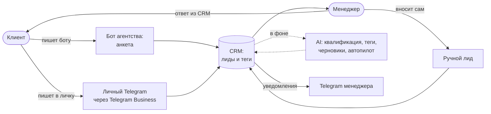

# Lidogram — эскиз продукта

*Рабочее название. Черновик: финальную версию со скриншотами сверим с тем, что выкатили.*

## Проблема

В небольшом digital-агентстве заявки приходят в Telegram: в бота, в личку владельцу, в личку
менеджеру. Они тонут среди рабочих и личных переписок. На них отвечают через несколько часов или
не отвечают вовсе. Никто не видит общей картины: сколько заявок, откуда они и какие из них горячие.
Большие CRM вроде amoCRM или Битрикс24 для команды из 2–4 человек тяжелы: их долго настраивать, а
менеджеры всё равно живут в Telegram.

## Для кого

Маленькое агентство: владелец и 1–3 менеджера. Клиенты пишут в Telegram. Отдела продаж нет, времени
на настройку CRM тоже нет.

## Идея

Заявки сами собираются из Telegram в одно место и приходят уже разобранными. AI определяет услугу,
бюджет, срочность и «температуру» лида и ставит теги из справочника агентства. Менеджер фильтрует
список по тегам и отвечает прямо из карточки лида — ответ уходит клиенту в тот же чат. На типовые
вопросы («сколько стоит лендинг?») может ответить AI-ассистент по базе знаний агентства. Всё, что
сложнее, он передаёт человеку и сразу присылает уведомление.

## Как это работает

Главное правило контура: путь «сообщение → лид → тег» не зависит от AI. Лид создаётся сразу, в
одной транзакции, а AI дорабатывает его в фоне. Если OpenAI недоступен, лиды и теги работают как
обычно, а диалог уходит человеку.

## Что входит в MVP

1. **Лиды из бота.** Анкета «имя → контакт → запрос», через несколько секунд лид уже в CRM.
2. **Лиды из личного Telegram** через Telegram Business (подробнее ниже).
3. **Ручное создание лида** в CRM.
4. **Теги:** справочник с цветами, теги на лиде, список лидов по тегу.
5. **AI:**
   - квалификация и автотеги;
   - копилот — черновик ответа, который менеджер правит и отправляет;
   - автопилот — AI отвечает сам и передаёт диалог менеджеру по правилам.
6. **Ответ клиенту из карточки лида** — через тот канал, откуда пришёл лид.
7. **Уведомления в Telegram:** новый лид и передача диалога от автопилота.
8. **Дашборд:** лиды по источникам, тегам и дням; сколько диалогов закрыл AI.

## Почему так

- **AI — надстройка, а не фундамент.** Худший исход — потерянная заявка из-за таймаута нейросети.
  Поэтому AI никогда не стоит на пути создания лида.
- **Модель предлагает, решает код.** Модель возвращает данные по строгой схеме. Передать ли диалог
  человеку, какие теги поставить, отправлять ли ответ — решают правила в коде: стоп-слова («договор»,
  «скидка», «менеджер»), низкая уверенность модели, лимит ответов. Любая ошибка AI — передача
  человеку, а не молчание.
- **Теги от AI — только из справочника.** Иначе за неделю появятся «лендос», «лендинг» и «landing».
  Если менеджер снял тег, поставленный AI, AI больше его не вернёт.
- **Автопилот по умолчанию — только в боте.** В личном аккаунте по умолчанию работает копилот:
  AI не пишет клиентам от имени живого человека, пока тот сам это не включит.

## Пункт 2: как подключаем личный Telegram

Используем **Telegram Business** — официальный способ подключить бота к личному аккаунту.

- **Подключение.** В @BotFather у бота включается Secretary Mode. Владелец аккаунта открывает
  «Настройки → Telegram Business → Чат-боты», добавляет бота и выбирает доступ «новые чаты и не
  контакты». Так переписка с друзьями и коллегами не попадает в CRM.
- **Ограничения.** Нужен Telegram Premium. Отвечать от имени аккаунта можно только в течение
  24 часов после последнего сообщения клиента. CRM показывает это и объясняет, почему отправка
  заблокирована.
- **Альтернатива — подключение аккаунта по QR-коду через MTProto** (как вход в Telegram Desktop).
  Она работает без Premium и видит все чаты. Но это неофициальный клиент: есть риск блокировки
  аккаунта, а нам пришлось бы хранить сессию с полным доступом к переписке. Для MVP риск
  несоразмерен, оставили на «следующую неделю».

## Что сознательно не делаем

- **Воронку и канбан.** Для 2–4 человек хватает тегов и статуса «ждёт ответа». Воронку строят под
  процесс продаж, а его мы пока не знаем.
- **Роли и права.** Один вход на команду. Роли нужны, когда появляется разделение обязанностей.
- **Другие каналы** (WhatsApp, почта, виджет на сайте). Проверяем гипотезу там, где у агентства
  основной поток, — в Telegram.
- **MTProto-юзербота** — причины выше.
- **Медиа.** Фото, голосовые и файлы отмечаем в переписке пометкой «[фото]», сам файл открывают в
  Telegram.
- **Оплаты и счета.** Это отдельная задача, не про обработку заявок.

## Как поймём, что это работает

- Ни одной заявки без ответа дольше пары часов в рабочее время.
- Время до первого ответа клиенту сокращается.
- Доля типовых вопросов, которые автопилот закрывает без человека, растёт, а передачи человеку
  остаются оправданными.
